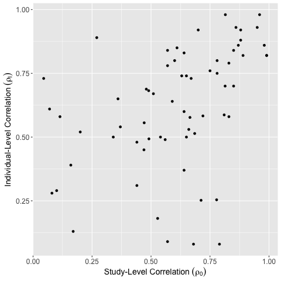

# ClinicalTrialsWithSurrogates

This repository contains data on Surrogate outcomes in clinical trials. The data is separated into two categories. 
The first category is data on different surrogate and true outcome pairs considered in oncology.
The second category is data specifically from Metastatic Breast Cancer trials, including data on both true and surrogate outcomes. 
The data is described in more detail below.


## Citing this work
The code and data included here are used for data analysis and simulation in the paper "Adaptive Clinical Trial Design with Surrogates: When Should We Bother?"

If you use the data or code included here, please use the following citation:


```
@article{anderer2021adaptive,
  title={Adaptive Clinical Trial Designs with Surrogates: When Should We Bother?},
  author={Anderer, Arielle and Bastani, Hamsa and Silberholz, John},
  journal={Management Science},
  year={2021}
}
```

## Data

### Different time-to-event surrogates
This group of data files contains data from meta-analyses on time-to-event surrogate outcomes, mostly in oncology trials. An example of how this data is useful can be found in the following plot:



Here, each dot represents a different surrogate/true outcome pair. We can see the individual-level correlation versus the study-level correlation for each pair. This helps us visualize what the relationship between these two values looks like across different potentially useful surrogate/true outcome pairs.


<b>TRUE_SURR_HR_Distribution.csv</b>: This file has data at the trial level on 30 different surrogate/true outcome pairs (we have information on between 7 and 36 trials for each pair) about hazard ratios for both outcomes. This information was compiled from scraping data from 21 meta-analyses for different diseases with time-to-event outcomes.

* Paper: id for meta-analysis it comes from (first 4 letters of first author’s last name + mmyy of publication)
* Disease: disease this trial is looking to treat
* TRUE: name or abbreviation of true outcome measured by the trial
* Surrogate: name or abbreviation of surrogate outcome measured by the trial
* Trial: Trial name/id
* Patients Treatment: treatment group size
* Patients Control: control group size
* HR Surrogate: the hazard ratio measured for the surrogate outcome
* CI Surrogate: confidence interval for HR Surrogate
* HR True: the hazard ratio measured for the true outcome 
* CI True: confidence interval for HR True


<b>IPD_surrogate_correlations.csv</b>: This file has information at the meta-analysis level on different surrogate/true outcome pairs about individual level and study level correlations. Compiled from scraping data from meta-analyses for different diseases with time-to-event outcomes. 
To collect these papers, we searched PubMed for meta-analyses of surrogate time-to-event endpoints and wound up with 80 papers. 
Some of these papers contain multiple surrogate endpoints for the same disease.

* Paper: id for meta-analysis it comes from (first 4 letters of first author’s last name + mmyy of publication)
* Disease: disease this trial is looking to treat
* Surrogate: name or abbreviation of surrogate outcome measured in the meta-analysis
* End Outcome: name or abbreviation of true outcome of interest measured in the meta-analysis
* Numerical Relationship to OS (Rho_I): reported individual level correlation (if
included)
* Rho_I 95% CI: reported confidence interval for individual level correlation (if
included)
* Treatment Effect Correlation (Rho_0): reported study level correlation (if
included)
* Rho_0 95% CI: reported confidence interval for study level correlation (if
included)
* Notes: any additional concerns


### Metastatic Breast Cancer (MBC)

This is historical trial-specific data for different MBC drug therapies. All of this data is pulled manually from repository of 1,865 studies of MBC drug therapies collected by Silberholz et al. (2019), which is publicly available at http://www.cancertrials.info


<b>KM curves</b>: This folder contains Kaplan-Meier curves pulled manually from the papers in the Silberholz et al. (2019) repository. It contains both images and data extracted from these images.

* .png files: one for each Kaplan Meier curve found in the papers in the
MBC repository. Labeled as “paper id”_”outcome”.png
* .xml files: one for each arm in every Kaplan Meier curve .png file.
Labeled as “paper id”_”outcome”_”arm id”.xml


<b>MBC_data_final.csv</b>: This file has information collected for each arm of each trial in MBC repository on the number of patients, the reported Hazard Ratios and related information for the different endpoints, and the names of the Kaplan-Meier curve data files if they exist.

* Unique_ID: “id of paper this arm comes from”_”arm specific id”
* Arm.Name: short description of trial arm
* Randomized: whether or not this was a randomized trial
* KM_Curves: Yes/No, whether this paper contained KM curves for this
arm
* N_Patient: number of patients in this arm of the trial
* OS: median overall survival for this arm of this trial
* OS_Comp: OS hazard ratio and confidence interval for this trial (if
recorded in paper; only recorded in one arm per trial)
* OS_pval: p-value for hazard ratio (if recorded in paper; only recorded in
one arm per trial)
* OS_events: total number of overall survival events seen in this trial arm (if
recorded in paper)
* OS_KM: file name for xml file of extracted overall survival KM curve for
this treatment arm
* OS_Note: anything else deemed important by RAs
* TTP: median time-to-progression for this arm of this trial
* TTP_Comp: TTP hazard ratio and confidence interval for this trial (if
recorded in paper; only recorded in one arm per trial)
* TTP_pval: p-value for hazard ratio (if recorded in paper; only recorded in
one arm per trial)
* TTP_events: total number of time-to-progression events seen in this trial
arm (if recorded in paper)
* TTP_KM: file name for xml file of extracted time-to-progression KM
curve for this treatment arm
* TTP_Note: anything else deemed potentially important by RAs
* PFS: median progression-free survival for this arm of this trial
* PFS_Comp: PFS hazard ratio and confidence interval for this trial (if
recorded in paper; only recorded in one arm per trial)
* PFS_pval: p-value for hazard ratio (if recorded in paper; only recorded in
one arm per trial)
* PFS_events: total number of progression-free survival events seen in this
trial arm (if recorded in paper)
* PFS_KM: file name for xml file of extracted progression-free survival KM
curve for this treatment arm
* PFS_Note: anything else deemed important by RAs

<b>MBC_info.csv</b>:This file has additional trial design and demographic information collected for each arm of each of the 89 trials in the MBC repository that contain Kaplan-Meier curves for both Overal Survival AND either Progression Free Survival or Time to Progression.

* Unique_ID: identification for paper and study arm
* ECOG_0: proportion of patients with level 0 ECOG performance status (Eastern
Cooperative Oncology Group (ECOG) performance status measures patient level
of functioning on a scale from 0 (active) to 5 (dead))
* ECOG_1: proportion of patients with level 1 ECOG performance status
* ECOG_2: proportion of patients with level 2 ECOG performance status
* ECOG_3: proportion of patients with level 3 ECOG performance status
* ECOG_4: proportion of patients with level 4 ECOG performance status
* N_Patient: number of patients in this arm of this study
* Pub_Year: year trial was published
* FRAC_MALE: fraction of participants in study arm who were male
* AGE_MED: median age of participant in study arm
* Prop_Visceral: proportion of patients with visceral disease (particularly severe
MBC spread to internal organs)
* OS: median overall survival reported in this arm
* PFS: median progression free survival reported in this arm
* Arm.Name: id for treatment given in this arm
* Title: title of the published study for this trial
* Arm_Type: experiment/control to delineate whether this arm was the experiment
or control arm
* Rand_Group: for multi-arm trials, there are multiple randomized comparisons;
this column delineates which arms were compared to one another.


<b>MBC_Phase.csv</b>: This file has some additional trial information collected for each arm of each of the trials in MBC repository.

* Unique_ID: “id of paper this arm comes from”_”arm specific id”
* Phase: I/II, II, or III indicating whether this is a phase I/II trial, a phase II
trial, or a phase III trial
* Arm_Type: control or experiment, denoting whether this is the control or
experiment arm


<b>OS_HR</b>: This file contains information on overall survival hazard ratios across different Metastatic Breast Cancer studies. This data was pulled manually from the subset of studies from the repository that contain estimates of overall survival hazard ratios.

* IDexp: id for experimental arm
* IDctl: id for control arm
* rcode: identification number for paper
* effect: HR effect size estimate for time to progression from paper 
* effectSD: standard deviation for effect size estimate

<b>PFS_HR</b>: This file contains information on progression free survival hazard ratios across different Metastatic Breast Cancer studies. This data was pulled manually from the subset of studies from the repository that contain estimates of progression free survival hazard ratios.

* IDexp: id for experimental arm
* IDctl: id for control arm
* rcode: identification number for paper
* effect: HR effect size estimate for time to progression from paper 
* effectSD: standard deviation for effect size estimate


<b>TTP_HR</b>: This file contains information on time to progression hazard ratios across different Metastatic Breast Cancer studies. This data was pulled manually from the subset of studies from the repository that contain estimates of time to progression hazard ratios.

* IDexp: id for experimental arm
* IDctl: id for control arm
* rcode: identification number for paper
* effect: HR effect size estimate for time to progression from paper 
* effectSD: standard deviation for effect size estimate


## Code

We also include code here which can be used to simulate clinical trials and analyze some of this data.

### Data analysis

#### Different time-to-event surrogates:

<b>Bivariate_Check.R</b>: Checks bivariate normality of surrogate and true effect sizes for different diseases

<b>IPD_surrogate_correlations.R</b>: Look at study-level vs. individual level correlation for different surrogate/true outcome pairs

#### Metastatic Breast Cancer (MBC):

<b>summaryTable.R</b>: Outputs a demographic summary table for the 89 trials in the MBC repository that contain Kaplan-Meier curves for both Overal Survival AND either Progression Free Survival or Time to Progression.

<b>Plot_MBCtrialInfo_OverTime.R</b>: Code for checking our equipoise assumption by plotting the hazard ratios for metastatic breast cancer clinical trials versus the year they were published.

### Simulation
<b>numericalSimulations.R</b>: Code for running numerical simulations based on underlying model with many different prior inputs.

<b>mainSim.R</b>: Code for simulating trials from the real data in KM Curves folder.

<b>Type1Type2SurvivalFunc_discounting.R</b>: Code for the fundamental functions needed for Type 1 / Type 2 Analysis for Survival.

<b>Parameterizing_prior_Simulation.R</b>: Code for choosing trial design parameters for a traditional true outcome only trial, a surrogate outcome only trial, and our proposed combined surrogate and true outcome trial design.

<b>misspecificationSensitivityAnalysis.R</b>: Code for sensitivity analysis to test robustness of our proposed combined surrogate and true outcome trial design to different types of misspecifications.

<b>expectedSuccess.R</b>: Code for running numerical simulations based on an objective function of maximizing the number of expected successes.


